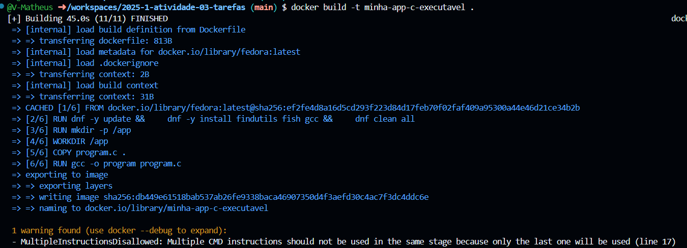

**Nome:** Victor Matheus Lopes de Sousa
**Data:** 02 de junho de 2025

### **1. Objetivo**
O objetivo foi utilizar um Dockerfile para criar um ambiente Fedora com GCC, visando compilar e executar um programa em C de forma isolada e com mapeamento de volume do hospedeiro.

---
### **2. Passos Executados**
1.  Criei um `Dockerfile` utilizando `fedora:latest` como base, instalando `gcc` e `fish`.
2.  Copiei o código-fonte C (`tarefa.c`) para a pasta do projeto.
3.  Construí a imagem Docker com o comando: `docker build -t so_atividade03_victor .`
4.  Executei o container de forma interativa, mapeando o diretório local para `/app` no container: `docker run -it --rm -v ${PWD}:/app so_atividade03_victor`
5.  Dentro do container, no shell `fish` em `/app`, compilei o código: `gcc -o tarefa tarefa.c`
6.  Executei o programa: `./tarefa`

---
### **3. Resultados Obtidos**
Primeiramente foi feito o build do container `Docker` como mostra em `docker_build.png`.

Logo em seguida programa C foi compilado e executado com sucesso dentro do container. A saída, conforme exibida na `docker_run.png`, mostrou a data atual seguida da mensagem "Tchau !", indicando o correto funcionamento do `fork` e `execve`. Não foram encontrados problemas significativos durante a prática.

---
### **4. Conclusão**
A prática demonstrou a eficácia do Docker para criar ambientes de desenvolvimento e execução consistentes e isolados, o que é especialmente útil para compilar e testar programas em C. O uso de Dockerfiles e mapeamento de volumes simplifica a configuração e o compartilhamento de projetos.